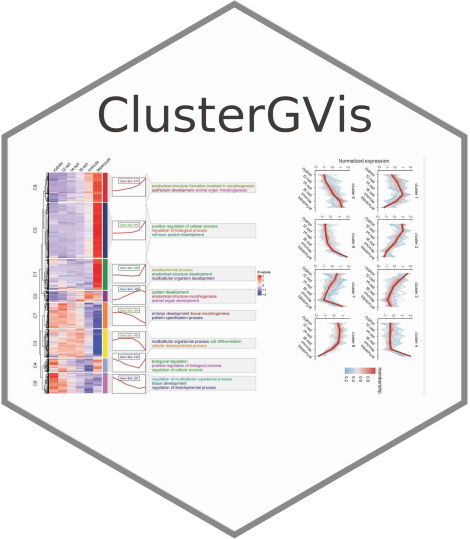

# ClusterGVis 

<!-- badges: start -->

For better clusteing and visualizing the time series gene expression data of RNA-SEQ with ***fuzzy c-means*** algorithm from e1071 package or ***Kmeans*** from ComplexHeatmap package, here supply [**ClusterGVis**](https://github.com/junjunlab/ClusterGVis) package to cluster and visualize time-serie gene expression data in a more concise and elegant way with one-step operation. ClusterGVis allows you to create ***publication-quality figures***.

Thanks for the contributions for [**Mfuzz**](https://www.bioconductor.org/packages/release/bioc/html/Mfuzz.html) and [**ComplexHeatmap**](https://jokergoo.github.io/ComplexHeatmap-reference/book/introduction.html)!

<!-- badges: end -->

## Installation

You can install the development version of transPlotR like so:

``` r
# install.packages("devtools")
devtools::install_github("junjunlab/ClusterGVis")
```

## Citation

> Jun Z (2022). *ClusterGVis: One-step to Cluster and Visualize Gene Expression Matrix.*  https://github.com/junjunlab/ClusterGVis, https://github.com/junjunlab/ClusterGVis/wiki/document

## Figures


## Document

> - https://github.com/junjunlab/ClusterGVis/wiki/document
> - https://github.com/junjunlab/ClusterGVis/wiki/version-0.0.2
