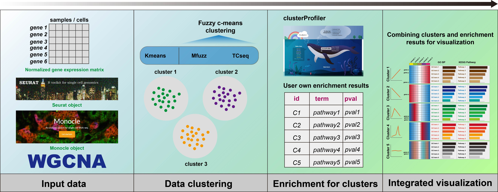

# ClusterGVis 


[](https://api.gitsponsors.com/api/badge/link?p=b/ezAJVN0xNqgLVUM5KpD3UFUaPcGiCX/bJh2svGqY75UqRIv5PTiwVjzvqbfzEVLAlmaI3tKih91d5pOhzL0Q==)

<!-- badges: start -->

To enhance clustering and visualization of time-series gene expression data from RNA-Seq experiments, we present the **ClusterGVis** package. This tool enables concise and elegant analysis of time-series gene expression data in a simple, one-step operation. Additionally, you can perform enrichment analysis for each cluster using the **enrichCluster** function, which integrates seamlessly with **clusterProfiler**. **ClusterGVis** empowers you to create publication-quality visualizations with ease.

Thanks for the contributions for [**clusterProfiler**](https://bioconductor.org/packages/release/bioc/html/clusterProfiler.html) and [**ComplexHeatmap**](https://jokergoo.github.io/ComplexHeatmap-reference/book/introduction.html)!

<!-- badges: end -->



## Requirements

There are some R package to make sure have been installed for better installing **ClusterGVis**：

``` r
BiocManager::install("ComplexHeatmap")
BiocManager::install("clusterProfiler")
BiocManager::install("TCseq")
BiocManager::install("Mfuzz")
BiocManager::install("monocle")
devtools::install_github('cole-trapnell-lab/monocle3')
install.packages("circlize")
install.packages("Seurat")
```

## Installation

You can install the development version of ClusterGVis like so:

``` r
# install from cran
install.packages("ClusterGVis")

# Note: please update your ComplexHeatmap to the latest version!
# install.packages("devtools")
devtools::install_github("junjunlab/ClusterGVis")
```

## Citation

> Jun Zhang (2022). *ClusterGVis: One-step to Cluster and Visualize Gene Expression Matrix.*  https://github.com/junjunlab/ClusterGVis

## Documentation

The comprehensive documentation:  [https://junjunlab.github.io/ClusterGvis-manual/](https://junjunlab.github.io/ClusterGvis-manual/)

## Interactive web App

[https://github.com/junjunlab/ClusterGvis-app](https://github.com/junjunlab/ClusterGvis-app)

## Related blogs

> - [**ClusterGVis 对基因表达时间序列聚类和可视化**](https://mp.weixin.qq.com/s?__biz=MzkyMTI1MTYxNA==&mid=2247507094&idx=1&sn=7c2872e4e7d92f0f16831f9e3b13f6ca&chksm=c184e6e7f6f36ff10ec1e41b1e45e90ffe8f0918878a6045fe0471c77729ea6af5d7e14beb5b&token=503374955&lang=zh_CN#rd)
> - [**ClusterGVis 的问题解答及优化**](https://mp.weixin.qq.com/s?__biz=MzkyMTI1MTYxNA==&mid=2247507124&idx=1&sn=bea21af4c86246715aed0219d4478aea&chksm=c184e6c5f6f36fd3a41222b014dd35ceeba8f983258fc36c287eab2188d4cbe3956f1e041d63&token=503374955&lang=zh_CN#rd)
> - [**ClusterGVis 对指定 cluster 添加注释**](https://mp.weixin.qq.com/s?__biz=MzkyMTI1MTYxNA==&mid=2247507173&idx=1&sn=8c384e0e8678d0b20086b31a3bc1fa70&chksm=c184e694f6f36f82489e1e514d68d3ad5e80577616d197c9f8784176601ac342b682ed02b9f9&token=503374955&lang=zh_CN#rd)
> - [**ClusterGVis 继续查缺补漏**](https://mp.weixin.qq.com/s?__biz=MzkyMTI1MTYxNA==&mid=2247507228&idx=1&sn=472e8fc2a17041b94043ac79e2018903&chksm=c184e76df6f36e7b3a6e0691a4140ebf030d323b9128cc3ab4c05c97d4000523dc71982bbecb&token=503374955&lang=zh_CN#rd)
> - [**ClusterGVis 添加多个样本注释**](https://mp.weixin.qq.com/s?__biz=MzkyMTI1MTYxNA==&mid=2247507410&idx=1&sn=c33809620a13392f420a9bc1160400ac&chksm=c184e7a3f6f36eb5286ca59cba9cc0f81bb2e1d8e6f769588faf5f324c945b8cfe8f50708780&token=133699415&lang=zh_CN#rd)
> - [**bugs 报告和修复**](https://mp.weixin.qq.com/s?__biz=MzkyMTI1MTYxNA==&mid=2247507735&idx=1&sn=d8236c12a07beecc5d6c181b196a9a78&chksm=c184e566f6f36c7072f382be27259127b4fa9c0b1228c891f5cfc35869861b3d9b8f6e9b0824&token=139164705&lang=zh_CN#rd)
> - [**ClusterGVis 对接单细胞啦**](https://mp.weixin.qq.com/s?__biz=MzkyMTI1MTYxNA==&mid=2247508319&idx=1&sn=6fe9cc5ea16468de8f8b15f00cdf8d22&chksm=c1849b2ef6f31238be4e1e414179470ea3084a9f7c62a9e334bbedc4f3605ffe8d924cba50e6&token=1432898004&lang=zh_CN#rd)
> - [**听说你还想添加 KEGG 注释?**](https://mp.weixin.qq.com/s?__biz=MzkyMTI1MTYxNA==&mid=2247508362&idx=1&sn=68c90f6b6cf328f220c2926e1ff68df6&chksm=c1849bfbf6f312eddc8839706dc81984fb6da270dec3505b351b69f775e49e92ea585b3c5d1c&token=1432898004&lang=zh_CN#rd)
> - [**ClusterGVis 对接 monocle2 拟时序热图**](https://mp.weixin.qq.com/s?__biz=MzkyMTI1MTYxNA==&mid=2247509140&idx=1&sn=3f46ed8760be054b173a60642d8fe608&chksm=c1849ee5f6f317f36c7cb7e496181c1d9b431cb0c7a674f8cd31e7960b8f0830c4e8e0490b7d&token=46732270&lang=zh_CN#rd)
> - [**听说你想画个 monocle3 的拟时序热图?**](https://mp.weixin.qq.com/s?__biz=MzkyMTI1MTYxNA==&mid=2247509312&idx=1&sn=5ab254679b6934cbe6c7a325154e1143&chksm=c1849f31f6f31627cc1148df6eb33e1e757a455c27d4822e864a28987aa2af95e9688b8061fd&token=553825481&lang=zh_CN#rd)
> - [**ClusterGVis 添加自定义图形注释**](https://mp.weixin.qq.com/s?__biz=MzkyMTI1MTYxNA==&mid=2247509499&idx=1&sn=888b0cb8401eb46c1f56c8e90fd2bb81&chksm=c1849f8af6f3169cfaf72e4818cd414375251b0fcf031bc05bda33fc39e7c9bae549cfc1e2bc&token=948441875&lang=zh_CN#rd)
> - [**听说你想插入 GO 和 KEGG 图形注释?**](https://mp.weixin.qq.com/s?__biz=MzkyMTI1MTYxNA==&mid=2247509510&idx=1&sn=5f1f4cb3a3f37abccc19265da77536f9&chksm=c1849c77f6f315618e2029f6837f483948e195489daaec481793cb30891641fa105e6bbbcd19&token=948441875&lang=zh_CN#rd)
> - [**enrichCluster 关于非模式物种富集分析的使用**](https://mp.weixin.qq.com/s?__biz=MzkyMTI1MTYxNA==&mid=2247514040&idx=1&sn=3d7005394edf920db316a4afceda3d01&chksm=c1848dc9f6f304df5624b8e0177c543fb210a07a0daa47efcb9b1520fba166c6c070860480a3&token=1281308534&lang=zh_CN#rd)
> - [**听说你想给 visCluster 添加行注释？**](https://mp.weixin.qq.com/s?__biz=MzkyMTI1MTYxNA==&mid=2247515529&idx=1&sn=b047eb05ccbce0a9ad6ee734b4188416&chksm=c18487f8f6f30eee3c027ac7c5f9b0babcc2fe737dfc2a6c5236e906ec6853b1f508e184af5f&token=2024721694&lang=zh_CN#rd)
